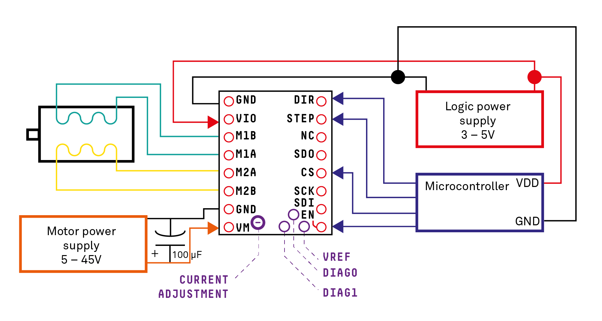

# Continuous Erosion
## What is the narrative of an artefact that destroys itself in the presence of the digital human?

Developed during the MAiR (Media Artist in Residence) 2017 at the residency site in Prolom Banja, a village surrounded by nature, this artefact explores the geological erosion of mythical stone formations at Đavolja Varoš (Devil’s Town) and accelerates the process by the intrusion of the digital layer that is placed upon humans in an almost ubiquitously way.

An earth surface process of erosion through friction is encapsulated within a physical artefact.
Human activities, such as intensive farming methods, are ultimately speeding up this process between 10 to 40 times its natural rate. The artefact picks up digital „pollution“ from smartphone devices in its vicinity. Human interference, illustrated as digital pollution through smartphones, speeds up the process of the artefact unwillingly.
Bombardement of invisible radio signals from our phones is not perceivable with the naked eye, but we can experience its influences physically and mentally. So does nature if we go down the chain of supply while scouting for more land and digging for resources.

The work consists of a series of „cards“ explaining different keywords: „RSSI“ (Radio Signal Strength Indicator), „Noise“, „Abrasion“, „Ageing“, „Silence“, „Signal“ and „Erosion“.

A NodeMCU (Microcontroller) is programmed to be in promiscious monitor mode(1) and look at all radio signals or „data packages“ floating through the air. The microcontroller will not make any attempts to connect to any WiFi hotspots, but rather just observe data packages from the outside and how strong their signal strength is. More data packages in closer proximity result in higher traffic around the microcontroller, which it has to experience. This tires out an internal „variable“ in the code and stresses the controller, thus starting to move the connected stepper motor in an irritating way.

The controller will only come down, once signals and noise around it vanish into silence – a perfectly calm equilibrium where nothing happens and moves. This state is hard to achieve and is best observed when no one is around.

––––––––––

(1) Based on the code „ESP8266 mini-sniff“ by Ray Burnette http://www.hackster.io/rayburne/projects

# TMC2103 Motor driver
Before this project was published there was no "good" wiring diagram for Arduino and the TMC2103 stepper motor driver.

# Exhibited at

* 